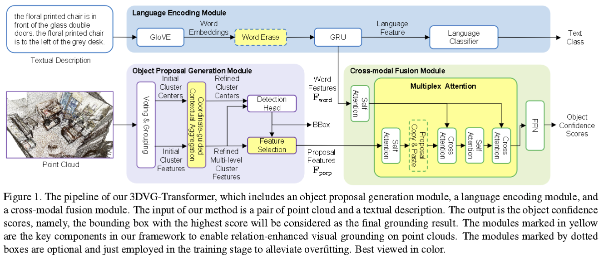
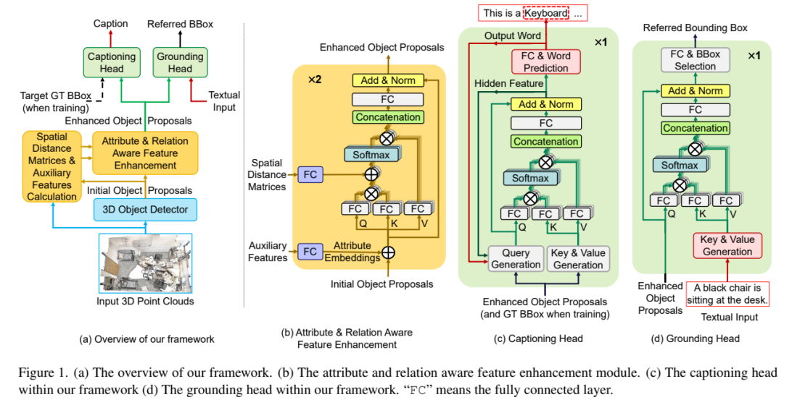
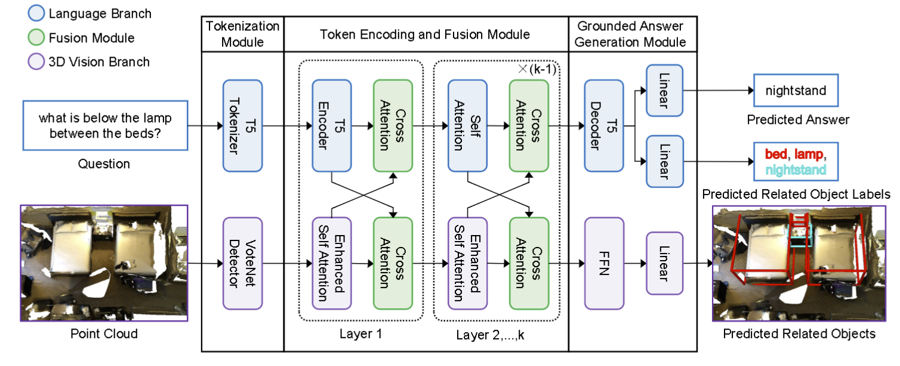

# Toward Explainable 3D Grounded Visual Question Answering: A New Benchmark and Strong Baseline

This repo aims to merge our 3DVL works and will be continuously updated, hopefully contributing to subsequent 3D visual language tasks.

## For 3D Visual Grounding:

#### 3DVG-Transformer: Relation modeling for visual grounding on point clouds (ICCV 2021)



```shell
python scripts/grounding_3dvg_trans_scripts/train_3dvg_transformer.py --use_multiview --use_normal --batch_size 8 --epoch 200 --gpu 0 --verbose 50 --val_step 1000 --lang_num_max 8 --lr 0.002 --coslr --tag 3dvg-trans+
```

## For 3D Joint Training (Visual Grounding & Dense Captioning):

#### 3DJCG: A Unified Framework for Joint Dense Captioning and Visual Grounding on 3D Point Clouds (CVPR 2022)



```shell
python scripts/joint_scripts/train_3djcg.py --use_multiview --use_normal --num_locals 20 --batch_size 10 --epoch 200 --gpu 1 --verbose 50 --val_step 1000 --lang_num_max 8 --coslr --lr 0.002 --num_ground_epoch 150 --tag 3djcg
```

## For 3D Grounded Question Answering:

####  Toward Explainable 3D Grounded Visual Question -Answering: A New Benchmark and Strong Baseline (TCSVT 2022)



```shell
python scripts/vqa_scripts/train_3dgqa.py --use_multiview --use_normal --batch_size 8 --epoch 200 --gpu 3 --verbose 50 --val_step 1000 --lang_num_max 8 --coslr --lr 0.002 --tag 3dgqa
```


## Citation

```
@article{zhao2022towards,
  author={Zhao, Lichen and Cai, Daigang and Zhang, Jing and Sheng, Lu and Xu, Dong and Zheng, Rui and Zhao, Yinjie and Wang, Lipeng and Fan, Xibo},
  journal={IEEE Transactions on Circuits and Systems for Video Technology}, 
  title={Towards Explainable 3D Grounded Visual Question Answering: A New Benchmark and Strong Baseline}, 
  year={2022},
  doi={10.1109/TCSVT.2022.3229081}
}

@inproceedings{cai20223djcg,
  title={3DJCG: A Unified Framework for Joint Dense Captioning and Visual Grounding on 3D Point Clouds},
  author={Cai, Daigang and Zhao, Lichen and Zhang, Jing and Sheng, Lu and Xu, Dong},
  booktitle={Proceedings of the IEEE/CVF Conference on Computer Vision and Pattern Recognition},
  pages={16464--16473},
  year={2022}
}

@inproceedings{zhao2021_3DVG_Transformer,
    title={{3DVG-Transformer}: Relation modeling for visual grounding on point clouds},
    author={Zhao, Lichen and Cai, Daigang and Sheng, Lu and Xu, Dong},
    booktitle={ICCV},
    pages={2928--2937},
    year={2021}
}

@article{chen2020scanrefer,
    title={{ScanRefer}: 3D Object Localization in RGB-D Scans using Natural Language},
    author={Chen, Dave Zhenyu and Chang, Angel X and Nie{\ss}ner, Matthias},
    pages={202--221},
    journal={ECCV},
    year={2020}
}
```

## Acknowledgement
We would like to thank [facebookresearch/votenet](https://github.com/facebookresearch/votenet) for the 3D object detection codebase and [erikwijmans/Pointnet2_PyTorch](https://github.com/erikwijmans/Pointnet2_PyTorch) for the CUDA accelerated PointNet++ implementation.

## License

This repository is released under MIT License (see LICENSE file for details).
