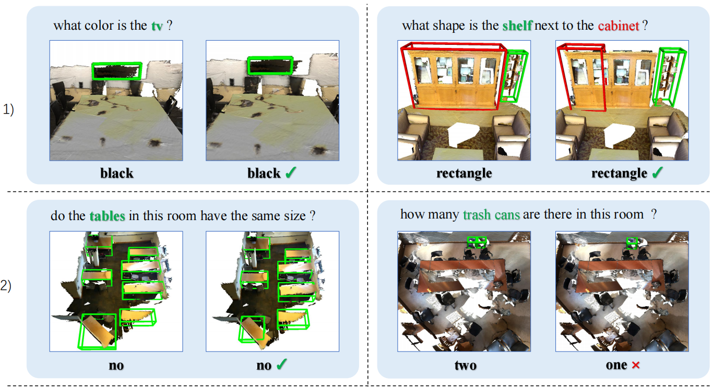
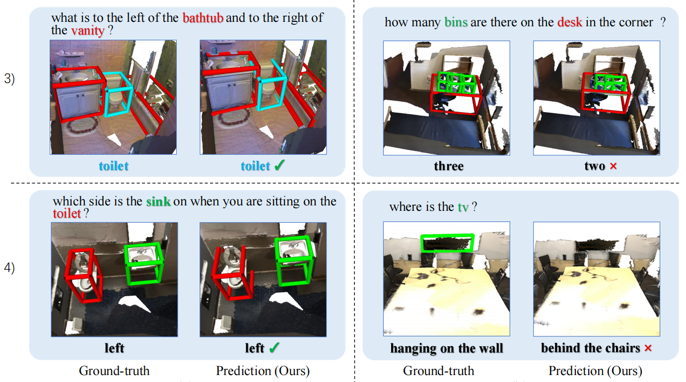
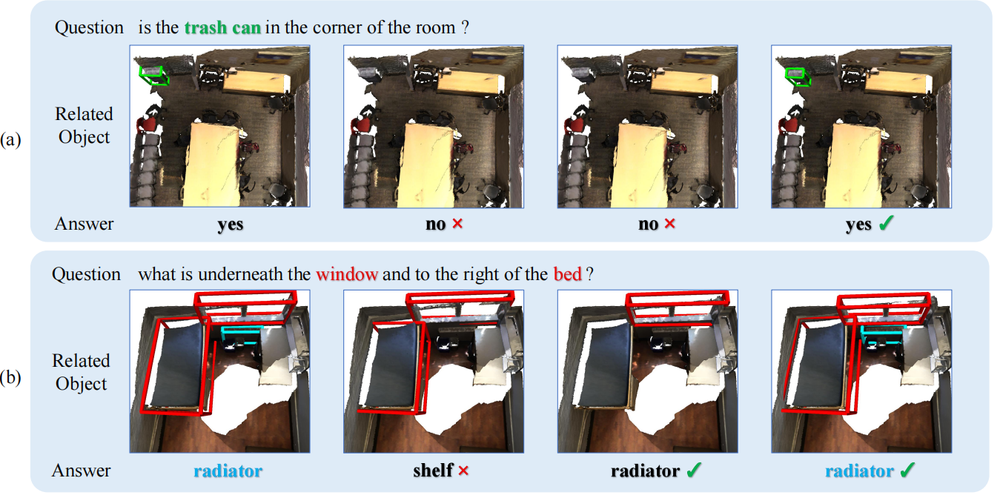
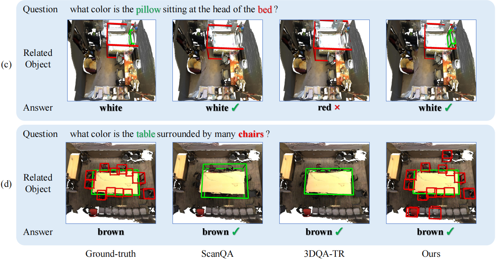

# Toward Explainable 3D Grounded Visual Question Answering: A New Benchmark and Strong Baseline

This repository is for the **T-CSVT 2022** paper "[Toward Explainable 3D Grounded Visual Question Answering: A New Benchmark and Strong Baseline](https://ieeexplore.ieee.org/abstract/document/9984686/)" [arxiv version](https://arxiv.org/abs/2209.12028)

## Introduction

In this work, we formally define and address a 3D grounded VQA task by collecting a new 3D question answering (GQA) dataset, referred to as flexible and explainable 3D GQA (FE-3DGQA), with diverse and relatively free-form question-answer pairs, as well as dense and completely grounded bounding box annotations. To achieve more explainable answers, we label the objects appeared in the complex QA pairs with different semantic types, including answer-grounded objects (both appeared and not appeared in the questions), and contextual objects for answer-grounded objects. We also propose a new 3D VQA framework to effectively predict the completely visually grounded and explainable answer. Extensive experiments verify that our newly collected benchmark datasets can be effectively used to evaluate various 3D VQA methods from different aspects and our newly proposed framework also achieves the state-of-the-art performance on the new benchmark dataset.






## Dataset & Setup

### Data preparation

*This codebase is built based on the initial [ScanRefer](https://github.com/daveredrum/ScanRefer)  and [3DVG-Transformer](https://github.com/zlccccc/3DVG-Transformer) codebase. Please refer to them for more data preprocessing details.*

1. Download the ScanRefer dataset and unzip it under `data/`. Download the [ScanVQA dataset](https://drive.google.com/drive/folders/1JR5AbuNHi_DFtIL-P1Wd_CF9QlpYG8cv?usp=share_link) and put it under data/ScanVQA/. You could also generate Extended VQA datasets (converting detection/grounding datasets to the gqa version, details can be seen in [our paper](https://arxiv.org/abs/2209.12028)) by using Dataprocessing/process_det.py.
2. Downloadand the preprocessed [GLoVE embeddings (~990MB)](http://kaldir.vc.in.tum.de/glove.p) and put them under `data/`.
3. Download the ScanNetV2 dataset and put (or link) `scans/` under (or to) `data/scannet/scans/` (Please follow the [ScanNet Instructions](data/scannet/README.md) for downloading the ScanNet dataset).

> After this step, there should be folders containing the ScanNet scene data under the `data/scannet/scans/` with names like `scene0000_00`

4. Pre-process ScanNet data. A folder named `scannet_data/` will be generated under `data/scannet/` after running the following command. Roughly 3.8GB free space is needed for this step:

```shell
cd data/scannet/
python batch_load_scannet_data.py
```

> After this step, you can check if the processed scene data is valid by running:
>
> ```shell
> python visualize.py --scene_id scene0000_00
> ```

5. (Optional) Pre-process the **multiview features** from ENet.

- Download:
    Download the ENet [multiview features (~36GB, hdf5 database)](http://kaldir.vc.in.tum.de/enet_feats.hdf5) and put it under `data/scannet/scannet_data/`

- Projection:

   a. Download [the ENet pretrained weights (1.4MB)](http://kaldir.vc.in.tum.de/ScanRefer/scannetv2_enet.pth) and put it under `data/`
   b. Download and decompress [the extracted ScanNet frames (~13GB)](http://kaldir.vc.in.tum.de/3dsis/scannet_train_images.zip).
   c. Change the data paths in `lib/config.py` marked with __TODO__ accordingly.
   d. Project ENet features from ScanNet frames to point clouds (~36GB, hdf5 database).


> ```shell
> python script/multiview_compute/compute_multiview_features.py --maxpool
> python script/multiview_compute/project_multiview_features.py --maxpool --gpu 1
> ```

### Setup
The code is tested on Ubuntu 16.04 LTS & 18.04 LTS with PyTorch 1.2.0 CUDA 10.0 installed.

Please refer to the initial [ScanRefer](https://daveredrum.github.io/ScanRefer/) for **pointnet2 packages** for the newer version (>=1.3.0) of PyTorch.

You could use other PointNet++ implementations for the lower version (<=1.2.0) of PyTorch.

```shell
conda install pytorch==1.2.0 torchvision==0.4.0 cudatoolkit=10.0 -c pytorch
```

Install the necessary packages listed out in `requirements.txt`:
```shell
pip install -r requirements.txt
```
After all packages are properly installed, please run the following commands to compile the CUDA modules for the PointNet++ backbone:
```shell
cd lib/pointnet2
python setup.py install
```
__Before moving on to the next step, please don't forget to set the project root path to the `CONF.PATH.BASE` in `lib/configs/config.py`.__

## Usage

### Training
To train the FE-3DGQA model with multiview features:
```shell
python scripts/vqa_scripts/train_3dgqa.py --use_multiview --use_normal --batch_size 8 --epoch 200 --gpu 3 --verbose 50 --val_step 1000 --lang_num_max 8 --coslr --lr 0.002 --tag 3dgqa
```
settings:
XYZ: --use_normal
XYZ+RGB: --use_color --use_normal
XYZ+Multiview: --use_multiview --use_normal

### Evaluation (TODO)
To evaluate the trained models, please find the folder under `outputs/` and run:
```shell
python scripts/vqa_scripts/eval.py --folder <folder_name> --reference --use_multiview --no_nms --force --repeat 5 --lang_num_max 1 --vqa
```
We also adopts evaluation for visual grounding by removing "--vqa" option.

Note that the flags must match the ones set before training. The training information is stored in `outputs/<folder_name>/info.json`

### Visualization (TODO)





To predict the localization results predicted by the trained ScanRefer model in a specific scene, please find the corresponding folder under `outputs/` with the current timestamp and run:

```shell
python scripts/vqa_scripts/visualize.py --folder <folder_name> --scene_id <scene_id> --use_color
```
Note that the flags must match the ones set before training. The training information is stored in `outputs/<folder_name>/info.json`. The output `.ply` files will be stored under `outputs/<folder_name>/vis/<scene_id>/

The generated .ply or .obj files could be visualized in software such as **MeshLab**.

### Results

settings:
3D Only (XYZ+RGB): --use_color --use_normal
2D+3D (XYZ+Multiview): --use_multiview --use_normal

|                    |                |   3D   |  VQA  | Results |       |  (ACC)  | Grounding |  Results   |               | (AP@0.5) |
| :----------------: | :------------: | :----: | :---: | :-----: | :---: | :-----: | :-------: | :--------: | :-----------: | :------: |
|      Methods       | Input Modality | number | color | yes/no  | other | overall |  AG-In-Q  | AG-NotIn-Q | Context-Of-AG |   mean   |
|    QA w/o Scene    |       -        | 29.21  | 32.31 |  55.65  | 17.59 |  37.25  |     -     |     -      |       -       |    -     |
|        MCAN        |       2D       | 35.08  | 44.42 |  59.73  | 28.99 |  44.50  |     -     |     -      |       -       |    -     |
|       Oscar        |       2D       | 35.83  | 39.33 |  64.77  | 30.80 |  46.19  |     -     |     -      |       -       |    -     |
|     CLIP-ViL_p     |       2D       | 35.74  | 39.44 |  64.00  | 30.60 |  46.25  |     -     |     -      |       -       |    -     |
|       ScanQA       |       3D       | 40.30  | 35.47 |  62.30  | 29.64 |  44.93  |   20.92   |    4.66    |     7.26      |  10.95   |
|      3DQA-TR       |       3D       | 34.48  | 36.27 |  66.98  | 29.39 |  45.95  |   13.71   |    5.10    |     10.23     |   9.68   |
|        Ours        |       3D       | 34.90  | 40.17 |  68.27  | 31.08 |  47.88  |   28.20   |   11.38    |     19.72     |  19.77   |
| Ours (manual+Ext.) |       3D       | 37.59  | 44.70 |  67.42  | 32.98 |  49.11  |   34.97   |   15.41    |     25.44     |  25.28   |
|       Human        |       3D       | 85.25  | 70.15 |  90.26  | 50.85 |  74.13  |   81.94   |   53.10    |     52.87     |  62.34   |

## Q & A

#### [BUG] Could not find lib.config:

```shell
try:
    from lib.config import CONF
except Exception as e:
    from lib.configs.config import CONF
```

#### [BUG] Could not find ScanRefer_filtered_organized.json:

ScanRefer_filtered_organized.json can be obtained by [Code](https://github.com/heng-hw/SpaCap3D/blob/16fcfb20f68f0b605b007aa554e12566175ef646/scripts/organize_scanrefer.py).


## Changelog

2023/01: Release the codes of FE-3DGQA.

2022/12: FE-3DGQA is accepted by TCSVT 2022.

2022/09: FE-3DGQA is available on Arxiv.

## Citation

If you use the codes in your work, please kindly cite our work FE-3DGQA:

```
@article{zhao2022towards,
  author={Zhao, Lichen and Cai, Daigang and Zhang, Jing and Sheng, Lu and Xu, Dong and Zheng, Rui and Zhao, Yinjie and Wang, Lipeng and Fan, Xibo},
  journal={IEEE Transactions on Circuits and Systems for Video Technology}, 
  title={Towards Explainable 3D Grounded Visual Question Answering: A New Benchmark and Strong Baseline}, 
  year={2022},
  doi={10.1109/TCSVT.2022.3229081}
}
```

## Acknowledgement
We would like to thank [facebookresearch/votenet](https://github.com/facebookresearch/votenet) for the 3D object detection codebase and [erikwijmans/Pointnet2_PyTorch](https://github.com/erikwijmans/Pointnet2_PyTorch) for the CUDA accelerated PointNet++ implementation.

## License

This repository is released under MIT License (see LICENSE file for details).
